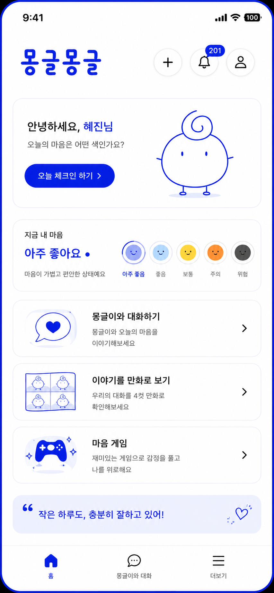

# 몽글몽글

일상 마음 케어 앱 **몽글몽글**은 오늘의 감정을 색으로 기록하고, 캐릭터 **몽글이**와 짧게 대화하며 마음의 흐름을 돌아보는 해커톤 MVP입니다.

<p align="center">
  
</p>

## 핵심 기능

- **오늘 체크인**: 떨어지는 단어 구름을 선택해 오늘의 마음 색을 정합니다.
- **몽글 대화**: `gpt-4o-mini` 기반 대화로 감정을 진단하지 않고 부드럽게 되비춥니다.
- **몽글 만화**: 대화 내용을 바탕으로 4컷 만화 흐름을 만드는 데모 화면을 제공합니다.
- **몽글 게임**: 감정 해소용 미니게임 데모 화면을 포함합니다.
- **앱형 화면**: 모바일 앱처럼 스크롤 없는 고정 화면 구조로 구성했습니다.

## 캐릭터와 색상

몽글이는 마음 색에 따라 색이 바뀝니다.

<p align="center">
  
  
  
  
  
</p>

| 마음 색 | 메인 컬러 | 경계 컬러 |
|---|---:|---:|
| Blue | `#6698FF` | `#DDEBFF` |
| Yellow | `#FBE7A1` | `#FFF7DD` |
| Orange | `#FFA500` | `#FED8B1` |
| Red | `#E42217` | `#FFCCCC` |
| Black | `#000000` | `#D3D3D3` |

<p align="center">
  
</p>

## AI 대화 원칙

몽글이는 상담사나 진단자가 아닙니다. 사용자의 말을 짧게 되비추고, 필요할 때만 열린 질문을 던집니다.

- 의료적·심리적 진단 금지
- 해결책 나열과 강한 조언 금지
- 질문은 답변당 최대 1개
- `normal`, `concern`, `crisis` 위험도 분류
- 위기 표현은 서버 고정 안전 문구 우선 사용
- 대화 기록은 서버 DB 없이 브라우저 `localStorage`에만 저장

## 화면 예시

<p align="center">
  
  
  
  
</p>

## 기술 스택

- Next.js App Router
- React
- JavaScript
- Tailwind CSS
- Framer Motion
- OpenAI API `gpt-4o-mini`
- Web Speech API
- localStorage

## 실행 방법

```bash
npm install
npm run dev
```

브라우저에서 `http://localhost:3000`을 엽니다.

## 환경 변수

루트에 `.env.local`을 만들고 OpenAI API 키를 넣습니다.

```env
OPENAI_API_KEY=sk-your-openai-api-key
OPENAI_MODEL=gpt-4o-mini
```

`.env.local`은 Git에 올라가지 않습니다. 배포 시에는 Vercel Project Settings의 Environment Variables에 같은 값을 등록합니다.

## 빌드

```bash
npm run lint
npm run build
```

## 만든 사람

**hyejinw**
